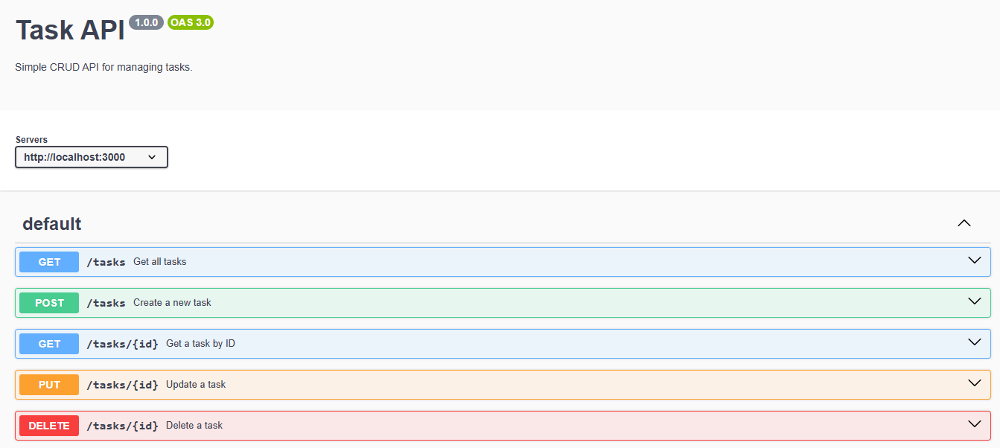

# Task API

A simple CRUD REST API built with **Node.js** and **Express.js**. It allows users to create, read, update, and delete tasks. The API also includes Swagger documentation.

## Features

- Create a task
- Get all tasks
- Get a task by ID
- Update a task
- Delete a task
- Health check endpoint
- Swagger UI documentation

## Installation

### Clone the repository

```bash
git clone https://github.com/<zia kazmi>/<CRUD-API>.git
cd <CRUD-API>
```

### Install dependencies

```bash
npm install
```

### Run the server

```bash
npm run dev
```

The server runs at:

```
http://localhost:3000
```

Swagger documentation:

```
http://localhost:3000/docs
```

## API Endpoints

| Method | Endpoint | Description |
|--------|----------|-------------|
| GET | `/` | API information |
| GET | `/health` | Health check |
| GET | `/tasks` | Get all tasks |
| GET | `/tasks/:id` | Get a task by ID |
| POST | `/tasks` | Create a new task |
| PUT | `/tasks/:id` | Update a task |
| DELETE | `/tasks/:id` | Delete a task |

## Example cURL Output

Request:

```bash
curl -i http://localhost:3000/tasks/1
```

Response:

```http
HTTP/1.1 200 OK
Content-Type: application/json; charset=utf-8

{
  "id": 1,
  "title": "Learn Express",
  "done": false
}
```

## Swagger UI

Open:

```
http://localhost:3000/docs
```

Add your Swagger UI screenshot here:



## Technologies Used

- Node.js
- Express.js
- Swagger UI Express

## Author

ZIA KAZMI